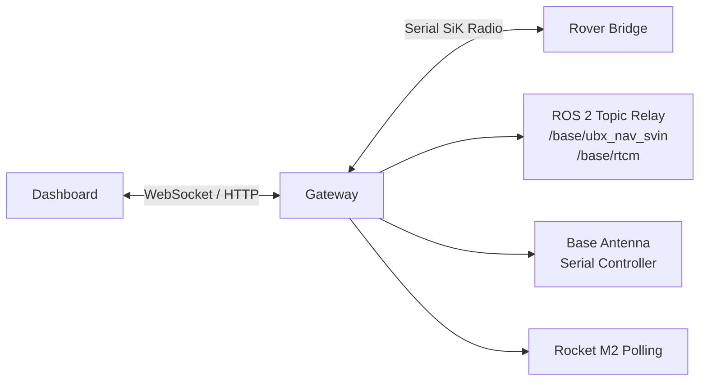

# MR2 Base Gateway

The gateway is the base-station process that sits between the dashboard,
the SiK radio link, and a few base-side services.

It does four jobs:

1. Accept dashboard commands over WebSocket and forward them over SiK.
2. Receive rover telemetry over SiK and rebroadcast it to dashboard clients.
3. Optionally relay selected ROS 2 base topics over SiK.
4. Optionally expose base-side HTTP utilities such as Transitive token minting
   and Rocket M2 status.

It implements the MR2 SiK protocol described in
`rover/ros2_ws/src/mr2_sik_bridge/README.md`.

## Runtime Topology



## Entry Point

- Package entry: `index.js`
- `npm start` runs `node index.js`
- Composition root: `src/app/create_gateway_app.js`

`index.js` is intentionally thin. It loads environment variables, parses
runtime config, creates the gateway app, starts it, and handles shutdown.

## Package Layout

```text
base/gateway/
├── index.js                        # package entrypoint
├── package.json
├── src/
│   ├── app/
│   │   └── create_gateway_app.js   # composition root
│   ├── antenna/
│   │   ├── base_station.js         # base antenna serial protocol client
│   │   └── tracker.js              # base antenna tracking logic
│   ├── protocol/
│   │   └── sik.js                  # SiK frame/message encode/decode
│   ├── runtime/
│   │   ├── http_handlers.js
│   │   ├── rocket_m2_client.js
│   │   ├── ros_topic_relay.js
│   │   ├── serial_link.js
│   │   └── ws_hub.js
│   ├── config.js                   # CLI/env parsing
│   └── rocket_m2.js                # Rocket M2 parsing/state helpers
└── test/                           # unit tests for extracted modules
```

The intended structure is:

- `src/app`: orchestration and lifecycle
- `src/runtime`: adapters for external systems
- `src/protocol`: wire format
- `src/antenna`: base antenna implementation
- `src/*.js`: package-level helpers that do not fit the above buckets

## Install

```bash
cd base/gateway
npm install
```

If you use the ROS 2 topic relay, source the ROS environment before starting
the gateway so `rclnodejs` can initialize correctly.

## Running

Minimal example:

```bash
cd base/gateway
npm start -- --device /dev/ttySIK --baud 57600 --port 8081
```

Example with antenna tracking enabled:

```bash
cd base/gateway
npm start -- \
  --device /dev/ttySIK \
  --baud 57600 \
  --port 8081 \
  --heartbeat-hz 2 \
  --antenna-enable true \
  --antenna-device /dev/ttyARDUINO
```

### Config Sources

Config is loaded in this order:

1. CLI flags
2. Environment variables
3. Built-in defaults

At startup the gateway loads `.env.local` if present, otherwise `.env`.

## Configuration

### Core

| CLI flag | Environment variable | Default |
| --- | --- | --- |
| `--device` | `SIK_DEVICE` | `/dev/ttySIK` |
| `--baud` | `SIK_BAUD` | `57600` |
| `--port` | `SIK_WS_PORT` | `8081` |
| `--heartbeat-hz` | `SIK_HEARTBEAT_HZ` | `2` |
| `--link-timeout-ms` | `SIK_LINK_TIMEOUT_MS` | `2000` |

### Base Antenna Tracking

| CLI flag | Environment variable | Default |
| --- | --- | --- |
| `--antenna-enable` | `BASE_ANTENNA_ENABLE` | `false` |
| `--antenna-device` | `BASE_ANTENNA_DEVICE` | `/dev/ttyARDUINO` |
| `--antenna-baud` | `BASE_ANTENNA_BAUD` | `115200` |
| `--antenna-cmd-hz` | `BASE_ANTENNA_CMD_HZ` | `2` |
| `--antenna-stale-ms` | `BASE_ANTENNA_STALE_MS` | `5000` |
| `--antenna-home` | `BASE_ANTENNA_HOME` | `true` |
| `--antenna-max-deg` | `BASE_ANTENNA_MAX_DEG` | `90` |
| `--antenna-smoothing` | `BASE_ANTENNA_SMOOTHING` | `0` |
| `--antenna-boot-wait-ms` | `BASE_ANTENNA_BOOT_WAIT_MS` | `2000` |
| `--antenna-log-ms` | `BASE_ANTENNA_LOG_MS` | `5000` |
| `--antenna-status-ms` | `BASE_ANTENNA_STATUS_MS` | `1000` |
| `--antenna-allow-provisional` | `BASE_ANTENNA_ALLOW_PROVISIONAL` | `true` |
| `--base-heading-deg` | `BASE_HEADING_OFFSET_DEG` | `0` |

### Rocket M2 Polling

| CLI flag | Environment variable | Default |
| --- | --- | --- |
| `--rocket-m2-enable` | `ROCKET_M2_ENABLE` | `false` |
| `--rocket-m2-ip` | `ROCKET_M2_IP` | empty |
| `--rocket-m2-user` | `ROCKET_M2_USER` | empty |
| `--rocket-m2-pass` | `ROCKET_M2_PASS` | empty |
| `--rocket-m2-poll-ms` | `ROCKET_M2_POLL_MS` | `5000` |
| `--rocket-m2-timeout-ms` | `ROCKET_M2_TIMEOUT_MS` | `4000` |

Rocket M2 polling auto-enables if IP, user, and password are configured.

## WebSocket Interface

Clients connect to the same HTTP server port configured by `--port`.

### Dashboard -> Gateway

- `cmd_drive`
  Fields: `linear_x_m_s`, `linear_y_m_s`, `angular_z_rad_s`
- `cmd_arm_twist`
  Fields: `lin_x_m_s`, `lin_y_m_s`, `lin_z_m_s`, `ang_x_rad_s`, `ang_y_rad_s`, `ang_z_rad_s`
- `cmd_arm_gripper`
  Fields: `position_norm`
- `heartbeat`
  Fields: none
- `mission_control`
  Fields: `command`, `clear_costmap`, `mission_id`
- `base_heading`
  Fields: `heading_deg`

### Gateway -> Dashboard

- `telem_battery`
  Fields: `battery_id`, `total_capacity_mah`, `available_capacity_mah`, `temperature_c`, `pack_voltage_v`
- `link_status`
  Fields: `connected`, `last_rx_ms`, `last_tx_ms`
- `telem_nav`
  Fields: `timestamp_ms`, `latitude_deg`, `longitude_deg`, `altitude_m`, `heading_deg`, `cov_x_var`, `cov_y_var`, `cov_yaw_var`
- `base_status`
  Fields: `enabled`, `antenna_ready`, `auto_home`, `heading_offset_deg`, `base_lat_deg`, `base_lon_deg`, `base_alt_m`, `antenna_heading_deg`, `last_cmd_heading_deg`, `last_cmd_age_ms`, `base_fix_age_ms`, `rover_nav_age_ms`, `base_fix_valid`, `rover_nav_valid`, `idle_reason`
- `rocket_m2_status`
  Fields: `connected`, `updated_at_ms`, `last_success_ms`, `signal`, `rssi`, `noisef`, `chwidth`, `rx_chainmask`, `chainrssi`, `chainrssimgmt`, `chainrssiext`, `error`

Notes:

- `battery_id` is `1` or `2`, mapped from SiK telemetry message IDs `0x10` and `0x11`.
- `link_status.connected` depends on recent incoming SiK heartbeat frames. It
  becomes `false` if no heartbeat is received within `SIK_LINK_TIMEOUT_MS`.

## HTTP Endpoints

### `GET /transitive/token`

Mints a Transitive JWT for the dashboard.

Required environment:

- `TRANSITIVE_JWT_SECRET`

Optional environment:

- `TRANSITIVE_ID` default `unknown`
- `TRANSITIVE_DEVICE` default `unknown`
- `TRANSITIVE_CAPABILITY` default `@transitive-robotics/webrtc-video`
- `TRANSITIVE_USER_ID` default `operator`
- `TRANSITIVE_VALIDITY` default `86400`

Optional query parameters override the environment values:

- `id`
- `device`
- `capability`
- `userId`
- `validity`

### `GET /rocket-m2/status`

Returns the latest polled Rocket M2 status as JSON.

Response behavior:

- `200` when status is available
- `503` when Rocket M2 is disabled or status is not ready yet
- `500` when Rocket M2 is enabled but missing required configuration

## ROS 2 Topic Relay

The ROS 2 topic relay subscribes to:

- `/base/ubx_nav_svin` (`ublox_ubx_msgs/msg/UBXNavSvin`)
- `/base/rtcm` (`rtcm_msgs/msg/Message`)

Those messages are encoded into SiK frames and forwarded to the rover side.

This module is named "topic relay" intentionally to avoid confusion with the
separate websocket-based `rosbridge` ecosystem.

## Base Antenna Modules

The base antenna support is split in two layers:

- `src/antenna/base_station.js`
  Raw serial protocol client for the antenna controller
- `src/antenna/tracker.js`
  Higher-level tracking logic that consumes rover navigation and base survey-in
  state, then emits heading commands

Example:

```js
const { BaseStationAntenna } = require('./src/antenna/base_station')

const antenna = new BaseStationAntenna({ device: '/dev/ttyUSB0', baud: 115200 })

antenna.on('ack', (msg) => console.log('ack', msg))
antenna.on('done', (msg) => console.log('done', msg))
antenna.on('error', (msg) => console.log('error', msg))

antenna.sendHoming()
antenna.sendMoveRad(0.3)
```

## Development

Run unit tests:

```bash
cd base/gateway
npm test
```
