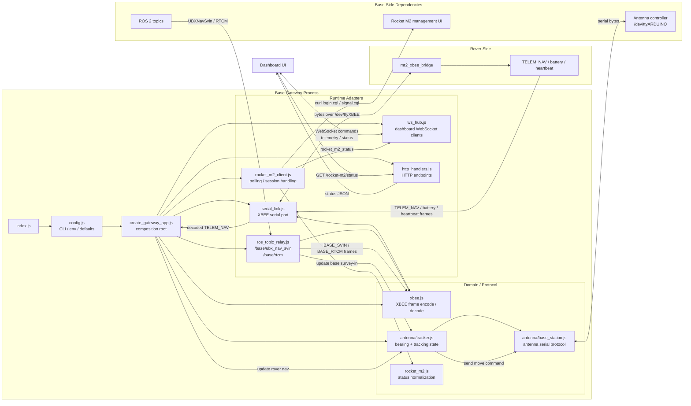

# MR2 Base Gateway

The gateway is the base-station process that sits between the dashboard,
the XBEE radio link, and a few base-side services.

It does four jobs:

1. Accept dashboard commands over WebSocket and forward them over XBEE.
2. Receive rover telemetry over XBEE and rebroadcast it to dashboard clients.
3. Optionally relay selected ROS 2 base topics over XBEE.
4. Optionally expose base-side HTTP utilities such as Rocket M2 status.

It implements the MR2 XBEE protocol described in
`rover/ros2_ws/src/mr2_xbee_bridge/README.md`.

For the dedicated video pipeline details, see
[`docs/video-pipeline.md`](../../docs/video-pipeline.md).

## Runtime Topology



## Entry Point

- Package entry: `index.js`
- `npm start` runs `node index.js`
- Composition root: `src/app/create_gateway_app.js`

`index.js` is intentionally thin. It loads environment variables, parses
runtime config, creates the gateway app, starts it, and handles shutdown.

## Package Layout

```text
base/gateway/
├── index.js                        # package entrypoint
├── package.json
├── src/
│   ├── app/
│   │   └── create_gateway_app.js   # composition root
│   ├── antenna/
│   │   ├── base_station.js         # base antenna serial protocol client
│   │   └── tracker.js              # base antenna tracking logic
│   ├── protocol/
│   │   └── xbee.js                  # XBEE frame/message encode/decode
│   ├── runtime/
│   │   ├── http_handlers.js
│   │   ├── rocket_m2_client.js
│   │   ├── ros_topic_relay.js
│   │   ├── serial_link.js
│   │   ├── ws_route_registry.js
│   │   └── ws_hub.js
│   ├── config.js                   # CLI/env parsing
│   ├── video/
│   │   ├── h264.js                 # Annex B parsing + access unit grouping
│   │   ├── protocol.js             # binary /video-ws message framing
│   │   ├── receiver.js             # one GStreamer child per stream
│   │   ├── service.js              # stream registry + client delivery
│   │   └── stream_config.js        # central JSON config loading/validation
│   └── rocket_m2.js                # Rocket M2 parsing/state helpers
└── test/                           # unit tests for extracted modules
```

The intended structure is:

- `src/app`: orchestration and lifecycle
- `src/runtime`: adapters for external systems
- `src/protocol`: wire format
- `src/antenna`: base antenna implementation
- `src/*.js`: package-level helpers that do not fit the above buckets

## Install

```bash
cd base/gateway
npm install
```

If you use the ROS 2 topic relay, source the ROS environment before starting
the gateway so `rclnodejs` can initialize correctly.

## Running

Minimal example:

```bash
cd base/gateway
npm start -- --base-xbee-device /dev/ttyXBEE --gateway-port 8081
```

Rover-local direct operation:

```bash
cd base/gateway
npm start -- \
  --gateway-profile rover-direct \
  --base-xbee-device /tmp/mr2_xbee_gateway \
  --gateway-host 127.0.0.1
```

The `rover-direct` profile keeps the XBEE and video WebSocket services. Its
defaults bind to loopback, use the local xbeesim PTY, and disable MAVProxy,
antenna tracking, Rocket M2 auto-enable, and the base GNSS/RTCM topic relay.
Explicit CLI settings still override profile defaults.

Example with antenna tracking enabled:

```bash
cd base/gateway
npm start -- \
  --base-xbee-device /dev/ttyXBEE \
  --gateway-port 8081 \
  --base-xbee-heartbeat-hz 2 \
  --antenna-enable true \
  --antenna-device /dev/ttyARDUINO
```

Example with video streaming enabled:

```bash
cd base/gateway
npm start -- \
  --base-xbee-device /dev/ttyXBEE \
  --gateway-port 8081 \
  --video-config ../../rover/ros2_ws/src/mr2_launch/config/video_streams.json \
  --video-jitter-ms 40
```

The base station needs a GStreamer runtime with `gst-launch-1.0`, `rtph264depay`,
`h264parse`, and `fdsink` available.

MAVProxy starts with the gateway by default:

```bash
mavproxy.py --master=/dev/ttySIK,57600 --out=udp:192.168.1.108:14550 --default-modules= --non-interactive
```

### Config Sources

Config is loaded in this order:

1. CLI flags
2. Component-specific environment variables
3. Top-level MR2 network environment variables
4. Built-in defaults

At startup the gateway loads the repository root `.env`, then root
`.env.local`, then `base/gateway/.env`, then `base/gateway/.env.local`.
Later files override earlier files. Use the root `.env` for shared network
values such as `MR2_GATEWAY_HOST`, `MR2_GATEWAY_PORT`, and
`MR2_BASE_ROCKET_IP`.

## Configuration

### Core

| CLI flag | Environment variable | Default |
| --- | --- | --- |
| `--gateway-profile` | `MR2_GATEWAY_PROFILE` | `base` |
| `--base-xbee-device` | `BASE_XBEE_DEVICE` | `/dev/ttyXBEE` |
| `--gateway-host` | `MR2_GATEWAY_HOST` | `0.0.0.0` |
| `--gateway-port` | `MR2_GATEWAY_PORT` | `8081` |
| `--base-xbee-heartbeat-hz` | `BASE_XBEE_HEARTBEAT_HZ` | `2` |
| `--base-xbee-link-timeout-ms` | `BASE_XBEE_LINK_TIMEOUT_MS` | `2000` |
| `--ros-topic-relay-enable` | `BASE_ROS_TOPIC_RELAY_ENABLE` | `true` |

For `rover-direct`, the profile defaults change the XBEE device to
`/tmp/mr2_xbee_gateway`, the bind host to `127.0.0.1`, and the topic relay to
`false`.

### MAVProxy

| CLI flag | Environment variable | Default |
| --- | --- | --- |
| `--mavproxy-enable` | `MAVPROXY_ENABLE` | `true` |
| `--mavproxy-binary` | `MAVPROXY_BINARY` | `mavproxy.py` |
| `--mavproxy-master-device` | `MAVPROXY_MASTER_DEVICE` | `/dev/ttySIK` |
| `--mavproxy-master-baud` | `MAVPROXY_MASTER_BAUD` | `57600` |
| `--mavproxy-out` | `MAVPROXY_OUT` | `udp:192.168.1.108:14550` |
| `--mavproxy-default-modules` | `MAVPROXY_DEFAULT_MODULES` | empty |

The default module list is intentionally empty because the gateway only needs
MAVLink forwarding. This avoids startup failures from optional MAVProxy modules
such as `adsb` being absent from the local Python environment.

### Video Streaming

| CLI flag | Environment variable | Default |
| --- | --- | --- |
| `--video-config` | `VIDEO_CONFIG_PATH` | `rover/ros2_ws/src/mr2_launch/config/video_streams.json` |
| `--video-gst-binary` | `VIDEO_GST_BINARY` | `gst-launch-1.0` |
| `--video-jitter-ms` | `VIDEO_JITTER_LATENCY_MS` | `40` |
| `--video-restart-ms` | `VIDEO_RECEIVER_RESTART_MS` | `1000` |
| `--video-client-max-buffered-bytes` | `VIDEO_CLIENT_MAX_BUFFERED_BYTES` | `1048576` |

### Base Antenna Tracking

| CLI flag | Environment variable | Default |
| --- | --- | --- |
| `--antenna-enable` | `BASE_ANTENNA_ENABLE` | `false` |
| `--antenna-device` | `BASE_ANTENNA_DEVICE` | `/dev/ttyARDUINO` |
| `--antenna-baud` | `BASE_ANTENNA_BAUD` | `115200` |
| `--antenna-cmd-hz` | `BASE_ANTENNA_CMD_HZ` | `2` |
| `--antenna-stale-ms` | `BASE_ANTENNA_STALE_MS` | `5000` |
| `--antenna-home` | `BASE_ANTENNA_HOME` | `true` |
| `--antenna-max-deg` | `BASE_ANTENNA_MAX_DEG` | `180` |
| `--antenna-smoothing` | `BASE_ANTENNA_SMOOTHING` | `0` |
| `--antenna-boot-wait-ms` | `BASE_ANTENNA_BOOT_WAIT_MS` | `2000` |
| `--antenna-log-ms` | `BASE_ANTENNA_LOG_MS` | `5000` |
| `--antenna-status-ms` | `BASE_ANTENNA_STATUS_MS` | `1000` |
| `--antenna-allow-provisional` | `BASE_ANTENNA_ALLOW_PROVISIONAL` | `true` |
| `--base-heading-deg` | `BASE_HEADING_OFFSET_DEG` | `0` |

### Rocket M2 Polling

| CLI flag | Environment variable | Default |
| --- | --- | --- |
| `--rocket-m2-enable` | `ROCKET_M2_ENABLE` | `false` |
| `--base-rocket-m2-ip` | `MR2_BASE_ROCKET_IP` | empty |
| `--drone-rocket-m2-ip` | `MR2_DRONE_ROCKET_IP` | empty |
| `--rover-rocket-m2-ip` | `MR2_ROVER_ROCKET_IP` | empty |
| `--rocket-m2-user` | `ROCKET_M2_USER` | empty |
| `--rocket-m2-pass` | `ROCKET_M2_PASS` | empty |
| `--rocket-m2-poll-ms` | `ROCKET_M2_POLL_MS` | `5000` |
| `--rocket-m2-timeout-ms` | `ROCKET_M2_TIMEOUT_MS` | `4000` |

Rocket M2 polling auto-enables if IP, user, and password are configured in the
base profile. The `rover-direct` profile disables this credential-based
auto-enable.

## Socket Interface

Clients connect to the same HTTP server port configured by `--gateway-port`.

### Control WebSocket

- Path: `/xbee-ws`
- Content: JSON command / telemetry messages

### Video WebSocket

- Path: `/video-ws`
- Content: binary `config` and `chunk` messages carrying H.264 access units
- Browser clients should subscribe by sending JSON messages like:

```json
{"type":"subscribe","stream_id":"front_nav_cam"}
```

### Video Metadata Endpoint

- Path: `/video/streams`
- Content: JSON stream definitions derived from the central `video_streams.json` file

### Latency Clock Endpoint

- Path: `/latency/time`
- Content: no-cache gateway receive/send epoch timestamps used for NTP-style
  browser-to-base clock-offset sampling

### Chrony Status Endpoint

- Path: `/latency/clock-status`
- Content: no-cache, read-only base `chronyc -n tracking` status
- Runtime requirement: the `chronyc` executable and local chronyd command
  socket; missing/unsynchronized chrony is returned as structured JSON instead
  of failing the gateway

The endpoint executes only the fixed `chronyc -n tracking` argument list with a
1.5 second timeout. It cannot start chrony, modify its configuration, or step a
clock. nginx proxies this endpoint alongside `/latency/time`; chrony's NTP UDP
port 123 is independent of nginx.

An experimentally tagged `cmd_drive` keeps the normal 16-byte XBEE payload.
The gateway broadcasts a JSON `latency_trace` mapping the dashboard `trial_id`
to the encoded `(xbee_seq, wire_timestamp_ms)` key. Untagged commands and the
XBEE wire protocol are unchanged.

Rocket M2 video-link latency is not derived from the post-GStreamer browser
timestamp. Use the matched rover/base RTP capture tools documented in
`scripts/latency/README.md`; they do not change the gateway video wire format.

### Dashboard -> Gateway

- `cmd_drive`
  Fields: `linear_x_m_s`, `linear_y_m_s`, `angular_z_rad_s`
- `cmd_arm_twist`
  Fields: `lin_x_m_s`, `lin_y_m_s`, `lin_z_m_s`, `ang_x_rad_s`, `ang_y_rad_s`, `ang_z_rad_s`
- `cmd_arm_joint`
  Fields: `velocities_rad_s` as six joint velocities for `arm_j1..arm_j6`; alternatively `arm_j1_rad_s` through `arm_j6_rad_s`
- `cmd_arm_gripper`
  Fields: `position_norm`
- `heartbeat`
  Fields: none
- `mission_control`
  Fields: `command`, `clear_costmap`, `mission_id`
- `base_heading`
  Fields: `heading_deg`

### Gateway -> Dashboard

- `telem_battery`
  Fields: `battery_id`, `total_capacity_mah`, `available_capacity_mah`, `temperature_c`, `pack_voltage_v`
- `link_status`
  Fields: `connected`, `last_rx_ms`, `last_tx_ms`
- `telem_nav`
  Fields: `timestamp_ms`, `latitude_deg`, `longitude_deg`, `altitude_m`, `heading_deg`, `cov_x_var`, `cov_y_var`, `cov_yaw_var`
- `base_status`
  Fields: `enabled`, `antenna_ready`, `auto_home`, `heading_offset_deg`, `base_lat_deg`, `base_lon_deg`, `base_alt_m`, `antenna_heading_deg`, `last_cmd_heading_deg`, `last_cmd_age_ms`, `base_fix_age_ms`, `rover_nav_age_ms`, `base_fix_valid`, `rover_nav_valid`, `idle_reason`
- `rocket_m2_status`
  Fields: `target` (`base`, `drone`, or `rover`), `label`, `connected`, `updated_at_ms`, `last_success_ms`, `signal`, `rssi`, `noisef`, `chwidth`, `rx_chainmask`, `chainrssi`, `chainrssimgmt`, `chainrssiext`, `error`
- `latency_trace` (only for a dashboard-tagged experiment command)
  Fields: `trial_id`, `client_tx_epoch_us`, `gateway_rx_epoch_us`, `xbee_seq`, `wire_timestamp_ms`

Notes:

- `battery_id` is `1` or `2`, mapped from XBEE telemetry message IDs `0x10` and `0x11`.
- `link_status.connected` depends on recent incoming XBEE heartbeat frames. It
  becomes `false` if no heartbeat is received within `BASE_XBEE_LINK_TIMEOUT_MS`.

## HTTP Endpoints

### `GET /rocket-m2/status`

Returns the latest polled Rocket M2 statuses as JSON.

Response behavior:

- `200` with `type: "rocket_m2_statuses"` when at least one target status is available
- `503` when Rocket M2 is disabled or status is not ready yet
- `500` when Rocket M2 is enabled but missing required configuration

## ROS 2 Topic Relay

The ROS 2 topic relay subscribes to:

- `/base/ubx_nav_svin` (`ublox_ubx_msgs/msg/UBXNavSvin`)
- `/base/rtcm` (`rtcm_msgs/msg/Message`)

Those messages are encoded into XBEE frames and forwarded to the rover side.

This module is named "topic relay" intentionally to avoid confusion with the
separate websocket-based `rosbridge` ecosystem.

## Base Antenna Modules

The base antenna support is split in two layers:

- `src/antenna/base_station.js`
  Raw serial protocol client for the antenna controller
- `src/antenna/tracker.js`
  Higher-level tracking logic that consumes rover navigation and base survey-in
  state, then emits heading commands

Example:

```js
const { BaseStationAntenna } = require('./src/antenna/base_station')

const antenna = new BaseStationAntenna({ device: '/dev/ttyUSB0', baud: 115200 })

antenna.on('ack', (msg) => console.log('ack', msg))
antenna.on('done', (msg) => console.log('done', msg))
antenna.on('error', (msg) => console.log('error', msg))

antenna.sendHoming()
antenna.sendMoveRad(0.3)
```

## Development

Run unit tests:

```bash
cd base/gateway
npm test
```
