<!-- _class: title -->

# MR2 전체 구조

<p class="subtitle">1회차: monorepo 전체를 한 번에 보기</p>

---

## 이 repo는 ROS 패키지 하나가 아니다

`mr2-stack`은 로버를 굴리는 데 필요한 여러 층을 한 repo에 같이 둔 monorepo다.

| 범위 | 들어있는 것 |
|---|---|
| web frontend | dashboard, map, video panel, mission UI |
| networking | nginx, TLS, WebSocket, Rocket M2, XBee |
| backend | base gateway, video gateway, status endpoints |
| ROS 2 | launch, robot description, control, perception, payload |
| navigation | Nav2, localization, GNSS/RTK, map/traversability |
| hardware / firmware | CAN devices, battery firmware, base antenna Arduino |
| ops scripts | deploy, udev, CAN bringup, diagnostics |

그래서 처음 볼 때는 "패키지 목록"보다 "어느 층의 코드인가"부터 잡는 게 낫다.

---

## 오늘 볼 것

- 이 monorepo가 어떤 큰 덩어리들로 나뉘는지
- 브라우저에서 누른 버튼이 어디로 가는지
- nginx, gateway, rosbridge가 각각 왜 있는지
- XBee, video, ROS service/action이 왜 다른 길을 타는지
- 문제가 났을 때 어느 컴퓨터, 어느 프로세스부터 볼지

---

## 전체 그림



---

## 실제로 떠 있는 것들

| 위치 | 프로세스 | 기술 | 하는 일 |
|---|---|---|---|
| base | nginx | nginx/TLS | dashboard 정적 서빙, reverse proxy |
| base | dashboard | React/Vite build | operator UI |
| base | gateway | Node.js | XBee, video, status, antenna |
| rover | rosbridge | rosbridge_server | browser와 ROS graph 연결 |
| rover | rover launch | ROS 2 Humble | control, autonomy, payload, sensors |
| rover/base | firmware | STM32/Arduino/device FW | CAN device, base antenna 등 |

---

## 이 표를 읽는 법

| 볼 것 | 뜻 | 이 시스템의 예 |
|---|---|---|
| 누가 요청하나 | client | browser dashboard |
| 누가 기다리나 | server/process | nginx, gateway, rosbridge |
| 어느 컴퓨터인가 | host | base station, rover |
| 어느 입구인가 | port/path | `:8081`, `:9090`, `/xbee-ws` |
| 어디로 넘기나 | proxy | nginx -> gateway, nginx -> rosbridge |

대부분의 연결은 이 질문으로 정리된다:

```text
browser가 base station nginx의 어떤 path로 붙고,
nginx가 그 요청을 어느 process로 넘기는가?
```

---

<!-- _class: section -->

# Dashboard

<p>사람이 보는 화면. 대부분의 조작은 여기서 시작한다.</p>

---

## Dashboard는 웹앱이다

`dashboard/package.json`

| 영역 | 쓰는 것 |
|---|---|
| App framework | React 18 + TypeScript |
| Build/dev server | Vite |
| UI | Bootstrap, react-bootstrap, react-icons |
| ROS browser bridge | roslib |
| Map | MapLibre GL |
| 3D | Three.js |
| Plot | uPlot |

빌드:

```sh
cd dashboard
npm run build
```

---

## 웹앱 쪽 기술

| 기술 | 여기서는 이렇게 보면 된다 |
|---|---|
| React | 화면을 component 단위로 나눠 만드는 JavaScript UI 라이브러리 |
| TypeScript | JavaScript에 타입을 붙인 언어. 메시지 모양 실수를 줄인다 |
| Vite | 개발 서버와 build 도구. `dist/` 정적 파일을 만든다 |
| Bootstrap | 버튼, 탭, 카드 같은 기본 UI 스타일 |
| roslib | 브라우저에서 rosbridge WebSocket에 붙는 라이브러리 |

브라우저는 ROS node가 아니다. ROS와 직접 말하지 못해서 gateway나 rosbridge가 필요하다.

---

## Dashboard 코드 읽는 법

| 보고 싶은 것 | 먼저 볼 파일 |
|---|---|
| 화면 구성 | `dashboard/src/components/*` |
| XBee command/telemetry | `dashboard/src/lib/xbeeGateway.ts` |
| ROS topic/service | `dashboard/src/lib/rosBridge.ts` |
| ROS action | `dashboard/src/lib/rosActionBridge.ts` |
| video stream | `dashboard/src/lib/videoGateway.ts` |
| map | `dashboard/src/components/MapPreview.tsx` |

UI bug인지, 통신 bug인지, rover 쪽 bug인지 여기서 1차로 갈린다.

---

## Dashboard가 붙는 세 갈래

| 파일 | 붙는 곳 | path |
|---|---|---|
| `src/lib/xbeeGateway.ts` | base gateway command/telemetry | `/xbee-ws` |
| `src/lib/videoGateway.ts` | base gateway H.264 video | `/video-ws`, `/video/streams` |
| `src/lib/rosBridge.ts` | rover ROS graph via rosbridge | `/rosbridge-ws` |
| `src/lib/rosActionBridge.ts` | ROS action over rosbridge | `/rosbridge-ws` |

drive, video, ROS service가 한 통로를 쓰지 않는다. 이걸 헷갈리면 디버깅이 바로 꼬인다.

---

## 화면 기능별로 다른 길

| 화면 기능 | 지나가는 길 |
|---|---|
| drive / heartbeat / e-stop | dashboard -> `/xbee-ws` -> gateway -> XBee -> rover |
| battery/nav telemetry | rover -> XBee -> gateway -> `/xbee-ws` -> dashboard |
| science service / spectrometer | dashboard -> `/rosbridge-ws` -> ROS service |
| mission/action | dashboard -> rosbridge action protocol -> ROS action server |
| video panels | dashboard -> `/video-ws` + `/video/streams` -> gateway video service |
| map/tiles | dashboard -> nginx `/tiles/` or external map source |

---

<!-- _class: section -->

# nginx / Deploy

<p>브라우저 입장에서는 한 사이트지만, 뒤에서는 여러 프로세스로 나뉜다.</p>

---

## HTTP, HTTPS, TLS

| 용어 | 한 줄 설명 |
|---|---|
| HTTP | 브라우저와 서버가 페이지/API를 주고받는 기본 규칙 |
| HTTPS | HTTP를 암호화해서 쓰는 방식 |
| TLS | HTTPS의 암호화 계층 |
| certificate | "이 서버가 누구인지" 브라우저에 보여주는 인증서 |
| self-signed cert | 우리가 직접 만든 인증서. 현장 내부망에서는 실용적이다 |

dashboard는 base station nginx에 HTTPS로 접속한다.

---

## WebSocket

HTTP는 보통 요청 한 번, 응답 한 번으로 끝난다.

WebSocket은 한 번 연결한 뒤 계속 열어둔다.

MR2에서 WebSocket을 쓰는 곳:

- `/xbee-ws`: command, heartbeat, telemetry
- `/video-ws`: browser로 H.264 chunk 전달
- `/rosbridge-ws`: browser와 rover ROS graph 연결

실시간성이 필요한 길은 대부분 WebSocket이다.

---

## nginx가 필요한 이유

nginx가 없으면 브라우저가 여러 주소를 직접 알아야 한다.

```text
dashboard static files
base gateway port
rover rosbridge port
tiles directory
TLS certificate
```

nginx가 있으면 브라우저는 base station 하나만 보면 된다.

```text
https://base.local/
```

---

## 배포 스크립트

`scripts/deploy_dashboard.bash`

`scripts/deploy_dashboard.bash`가 하는 일:

- `.env`에서 base/rover/gateway/rosbridge 주소를 읽는다
- `dashboard`에서 `npm install`, `npm run build`
- `dashboard/dist`를 `/var/www/mr2-dashboard`로 배포
- `/var/www/mr2-tiles` 생성
- nginx 설치 확인
- self-signed TLS certificate를 만든다
- nginx config를 깔고 reload한다

---

## nginx 라우팅

`scripts/nginx/mr2-dashboard-locations.conf`

| URL | 어디로 보내나 |
|---|---|
| `/` | `/var/www/mr2-dashboard` static app |
| `/xbee-ws` | `mr2_gateway` WebSocket proxy |
| `/video-ws` | `mr2_gateway` WebSocket proxy |
| `/video/streams` | `mr2_gateway` HTTP proxy |
| `/rocket-m2/status` | `mr2_gateway` HTTP proxy |
| `/transitive/token` | `mr2_gateway` HTTP proxy |
| `/rosbridge-ws` | `mr2_rover_rosbridge` WebSocket proxy |
| `/tiles/` | `/var/www/mr2-tiles/` static files |

---

## nginx upstream

`scripts/nginx/mr2-dashboard.conf.template`

```nginx
upstream mr2_gateway {
  server __MR2_GATEWAY_HOST__:__MR2_GATEWAY_PORT__;
}

upstream mr2_rover_rosbridge {
  server __MR2_ROVER_IP__:__MR2_ROSBRIDGE_PORT__;
}
```

nginx가 base station의 입구다. gateway와 rover rosbridge를 한 HTTPS origin 뒤에 숨긴다.

---

<!-- _class: section -->

# Base Gateway

<p>base station에서 radio, video, antenna, dashboard를 묶는 Node.js 프로세스.</p>

---

## Node.js는 여기서 뭘 하나

Node.js는 JavaScript를 브라우저 밖에서 실행하는 runtime이다.

gateway가 Node.js로 되어 있는 이유:

- WebSocket server 만들기 쉽다
- serial port를 다루는 라이브러리가 있다
- dashboard와 주고받는 JSON을 다루기 편하다
- ROS가 없어도 base utility process로 뜰 수 있다

여기서는 "브라우저와 radio 사이의 중간 서버"라고 보면 된다.

---

## Gateway 라이브러리 이름 읽기

| 라이브러리 | 뜻 |
|---|---|
| `ws` | WebSocket server/client library |
| `serialport` | `/dev/ttyXBEE`, `/dev/ttyARDUINO` 같은 serial device 접근 |
| `rclnodejs` | Node.js에서 ROS 2 topic을 구독/발행 |
| `dotenv` | `.env` 파일에서 설정값을 읽음 |

`package.json`은 "이 앱이 어떤 외부 기술에 기대는지" 보는 첫 파일이다.

---

## Gateway도 별도 앱이다

`base/gateway/package.json`

| 기술 | 쓰는 곳 |
|---|---|
| Node.js CommonJS | gateway runtime |
| `ws` | dashboard WebSocket server |
| `serialport` | XBee serial, antenna serial |
| `rclnodejs` | optional base-side ROS topic relay |
| `dotenv` | `.env`/`.env.local` config loading |

실행:

```sh
cd base/gateway
npm start -- --base-xbee-device /dev/ttyXBEE --gateway-port 8081
```

---

## Gateway 코드 구조

```text
base/gateway/
├── index.js
├── src/app/create_gateway_app.js
├── src/runtime/
│   ├── ws_hub.js
│   ├── http_handlers.js
│   ├── serial_link.js
│   ├── ros_topic_relay.js
│   └── rocket_m2_client.js
├── src/protocol/xbee.js
├── src/video/
└── src/antenna/
```

`create_gateway_app.js`에서 WebSocket, serial, video, ROS relay, Rocket M2 client를 한꺼번에 조립한다.

---

## Gateway 안의 부품들

| 하는 일 | 코드 |
|---|---|
| dashboard WebSocket clients | `runtime/ws_hub.js` |
| HTTP utility endpoints | `runtime/http_handlers.js` |
| XBee serial bytes | `runtime/serial_link.js` |
| XBee frame encode/decode | `protocol/xbee.js` |
| base ROS topic relay | `runtime/ros_topic_relay.js` |
| video stream service | `video/service.js`, `video/receiver.js` |
| Rocket M2 status polling | `runtime/rocket_m2_client.js` |
| antenna tracking | `antenna/tracker.js`, `antenna/base_station.js` |

---

## XBee 명령/텔레메트리 경로


텔레메트리는 거의 반대 방향으로 돌아온다.

---

## Base 쪽 ROS relay

`base/gateway/src/runtime/ros_topic_relay.js`

- base station의 ROS topic을 dashboard 없이 XBee로 보낼 수 있다
- `/base/ubx_nav_svin`, `/base/rtcm` 같은 topic을 구독한다
- `BASE_SVIN`, `BASE_RTCM`, fragmented RTCM frame으로 인코딩한다
- ROS가 없어도 gateway 자체는 뜰 수 있게 optional로 되어 있다

---

## Rocket M2, antenna, base utility

| 기능 | 흐름 |
|---|---|
| Rocket M2 status | gateway polls Rocket M2 management pages, dashboard reads `/rocket-m2/status` |
| antenna tracker | base survey-in + rover nav -> heading command |
| antenna serial | gateway talks to Arduino antenna controller |
| transitive token | gateway가 노출하는 작은 HTTP utility |

이건 rover ROS node는 아니지만, 현장에서는 자주 보는 base station 기능이다.

---

<!-- _class: section -->

# Video

<p>Video는 rosbridge로 밀어 넣지 않고 gateway 쪽 별도 경로를 탄다.</p>

---

## Video 용어

| 용어 | 한 줄 설명 |
|---|---|
| stream | 계속 들어오는 영상 데이터 흐름 |
| frame | 영상 한 장 |
| codec | 영상을 압축하고 푸는 방식 |
| H.264 | 브라우저와 장비에서 널리 쓰는 영상 압축 방식 |
| GStreamer | 카메라, 인코더, 네트워크 송수신을 파이프라인으로 묶는 도구 |
| metadata | stream 이름, 해상도, 사용 가능 여부 같은 설명 데이터 |

영상은 데이터가 크다. ROS topic 그대로 브라우저로 보내면 부담이 커서 별도 경로를 둔다.

---

## Video가 오는 길



같이 볼 파일:

- `docs/video-pipeline.md`
- `base/gateway/src/video/*`
- `dashboard/src/lib/videoGateway.ts`

---

## Video gateway 파일들

| 파일 | 하는 일 |
|---|---|
| `video/stream_config.js` | stream config loading/validation |
| `video/receiver.js` | one GStreamer child per stream |
| `video/h264.js` | Annex B parsing, access unit grouping |
| `video/protocol.js` | browser binary message framing |
| `video/service.js` | stream registry and client delivery |

dashboard 쪽:

- `src/lib/videoGateway.ts`
- `src/lib/videoProtocol.ts`
- `src/components/VideoStreamCard.tsx`

---

<!-- _class: section -->

# Rover ROS 2

<p>로버 안쪽. 센서, 제어, 자율주행, payload가 ROS graph로 붙는다.</p>

---

## ROS 2 기본 단어

| 용어 | 한 줄 설명 |
|---|---|
| node | ROS에서 실행되는 프로그램 단위 |
| topic | 계속 흘러가는 데이터. sensor, command, status에 많이 쓴다 |
| service | 요청 한 번, 응답 한 번. 장치 명령에 많이 쓴다 |
| action | 오래 걸리는 작업. goal, feedback, result가 있다 |
| parameter | node 설정값 |
| TF | 로봇의 좌표계 관계 |

ROS 쪽 디버깅은 node가 떠 있는지, topic/service/action 이름이 맞는지부터 본다.

---

## rosbridge가 하는 일

브라우저는 ROS 2 node가 아니고 DDS도 직접 쓰지 않는다.

`rosbridge_server`는 WebSocket으로 들어온 JSON 메시지를 ROS topic, service, action 호출로 바꿔준다.

```text
browser roslib
  <-> WebSocket JSON
rosbridge_server
  <-> ROS graph
```

dashboard에서 science service나 mission action을 누를 수 있는 이유가 이 bridge다.

---

## ROS 2 쪽 스택

| 기술 | 쓰는 곳 |
|---|---|
| ROS 2 Humble | node/topic/service/action/parameter/TF |
| colcon + ament | ROS package build/install |
| launch | runtime composition |
| rosbridge_server | browser WebSocket -> ROS graph |
| ros2_control | controller manager, hardware interface |
| Nav2 | navigation, behavior trees |
| robot_localization | EKF, GNSS/IMU fusion |
| Gazebo/Ignition | simulation backend |

---

## Rover 쪽 시작점

| 패키지 | 하는 일 |
|---|---|
| `mr2_launch` | top-level rover bringup |
| `mr2_rover_description` | URDF/Xacro, controller config, sim/real launch |
| `mr2_rover_control` | custom rover controller |
| `mr2_rover_auto` | mission, Nav2, localization, map/traversability |
| `mr2_xbee_bridge` | XBee protocol to ROS bridge |
| `mr2_video_streaming` | rover-side video transport |

`mr2_launch/launch/rover.launch.py`에서 `rosbridge_server`도 9090번으로 띄운다.

---

## rosbridge 경로

```text
dashboard roslib
      |
nginx /rosbridge-ws
      |
rosbridge_server on rover :9090
      |
ROS graph
      |
topics / services / actions
```

주로 여기서 쓴다:

- science module service calls
- spectrophotometer service calls
- mission/action panels
- manipulator/state subscriptions
- selected ROS telemetry not carried over XBee

---

## ROS control에서 CAN까지

```text
ROS command
      |
controller manager
      |
mr2_rover_control
      |
mr2_can_hardware_interface
      |
mr2_can_bus_core
      |
CAN devices
```

주행 명령이 실제 장치 명령으로 내려가는 구간이다.

---

<!-- _class: section -->

# Hardware / Network

<p>마지막에는 radio, Ethernet, serial, CAN, camera, GNSS 같은 물리 링크가 남는다.</p>

---

## 물리 링크를 왜 봐야 하나

소프트웨어가 맞아도 실제 링크가 죽으면 아무것도 안 된다.

예:

- WebSocket은 붙었는데 XBee serial device가 없다
- ROS service는 성공했는데 CAN 장치가 응답하지 않는다
- video WebSocket은 열렸는데 UDP/GStreamer 입력이 없다
- GNSS node는 떠 있는데 serial device 이름이 바뀌었다

그래서 이 프로젝트는 web, ROS, hardware를 같이 봐야 한다.

---

## 물리 링크

| 링크 | 쓰는 곳 |
|---|---|
| HTTPS/WSS | browser to base nginx |
| Ethernet / Rocket M2 | base-rover network, status monitoring |
| XBee serial/radio | command, heartbeat, selected telemetry |
| UDP/GStreamer | video transport |
| CAN / SocketCAN | motor, actuator, battery, LED, science devices |
| USB/serial | u-blox GNSS, base antenna Arduino, XBee |

---

## Firmware / low-level

| 위치 | 하는 일 |
|---|---|
| `base/arduino` | base antenna controller firmware/tools |
| `rover/firmware` | device firmware such as battery firmware |
| CAN device packages | ROS-side protocol/client layer |
| scripts/udev | stable serial device names |
| scripts/can*.bash | CAN bringup/test helpers |

장치 문제가 나면 ROS graph만 봐서는 부족하다. serial, CAN, firmware까지 내려가야 한다.

---

## 빌드 도구도 여러 개다

| 영역 | 명령 |
|---|---|
| dashboard | `npm install`, `npm run build`, `npm run check` |
| base gateway | `npm install`, `npm start`, `npm test` |
| rover ROS 2 | `colcon build`, `ros2 launch` |
| deployment | `scripts/deploy_dashboard.bash`, `nginx -t`, `systemctl reload nginx` |
| CAN/serial ops | `scripts/can0.bash`, udev install scripts |
| slides/docs | Nix + Marp |

로그를 볼 때 먼저 어느 toolchain에서 난 에러인지부터 나눈다.

---

<!-- _class: section -->

# End-to-End

<p>기능 하나를 잡고 끝까지 따라가면 구조가 빨리 잡힌다.</p>

---

## 1. Drive command


볼 곳: browser WS, nginx proxy, gateway serial, radio link, rover bridge, controller, CAN.

---

## 2. Science service


볼 곳: roslib connection, rosbridge, service name/type, node, CAN/device response.

---

## 3. Video stream


볼 곳: stream config, UDP/GStreamer, codec state, gateway WS, browser decoder/render path.

---

## 4. Map / autonomy status

```text
ROS Nav2 / localization / mission nodes
 -> ROS topics/actions
 -> rosbridge or XBee telemetry path
 -> dashboard map / mission panels
```

map 화면에는 여러 데이터가 섞인다:

- rover GPS/nav telemetry from XBee
- ROS mission/action state through rosbridge
- tile/static map data through nginx `/tiles/`
- external map imagery in development

---

## 어디부터 볼지

```text
Browser blank       -> dashboard build, nginx static, browser console
WS disconnected     -> nginx route, gateway/rosbridge process, port/env
No command effect   -> gateway serial, XBee link, rover bridge, controller
ROS service fails   -> rosbridge, service name/type, node availability
Video missing       -> stream metadata, GStreamer, /video-ws, codec config
Telemetry stale     -> XBee frames, gateway decode, rover publisher
CAN failure         -> SocketCAN, device package, firmware, wiring
```

---

## 데모 때 볼 명령

```sh
# nginx routes
sed -n '1,120p' scripts/nginx/mr2-dashboard-locations.conf

# dashboard clients
rg "/xbee-ws|/video-ws|/rosbridge-ws" dashboard/src

# gateway composition
sed -n '1,220p' base/gateway/src/app/create_gateway_app.js

# rover rosbridge
rg "rosbridge_websocket|xbee_bridge" rover/ros2_ws/src/mr2_launch/launch
```

---

## 다음 회차들

| 회차 | 주제 | 질문 |
|---|---|---|
| 1 | 전체 system stack | browser부터 hardware까지 어떤 경로를 타나? |
| 2 | rover description/sim/launch | 로버 ROS graph는 어떻게 조립되나? |
| 3 | control/CAN/XBee | 명령이 어떻게 하드웨어로 내려가나? |
| 4 | autonomy/Nav2/GNSS | mission이 어떻게 경로와 동작으로 바뀌나? |
| 5 | dashboard/gateway/ops | base station 운영과 UI/telemetry/video는 어떻게 고치나? |

---

## 다음 전까지

기능 하나를 골라서 브라우저부터 rover 쪽까지 5분 안에 따라가 본다.

예시:

- drive command
- science module command
- spectrophotometer capture
- mission start/pause
- camera video panel
- Rocket M2 status card
- GNSS/base antenna status

포함할 것:

- dashboard component
- URL/path or ROS interface
- gateway/rosbridge involvement
- rover-side package
- hardware or external dependency
